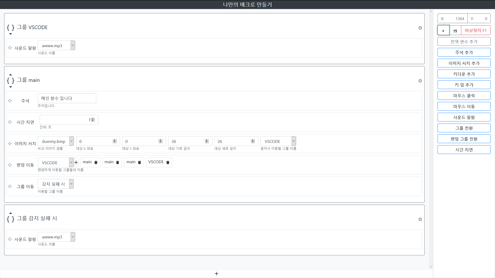

# AutoMacro

## 개발 환경
* Windows 10
* Python 3
* Firefox

## 개발 환경 설치 과정
1. Pycharm, Visual Studio Code, NPM을 설치 한다.
2. Pycharm 에서 가상환경을 생성후 requirements.txt로 필요한 파이썬 패키지를 설치한다.
3. 프로젝트 디렉토리에서 `npm -i`를 입력하여 필요한 Node.js 패키지를 설치한다.
4. Visual Studio Code에서 NPM Script->Start로 개발 프론트 서버를 가동한다.
5. Pycharm 가상환경에서 `run.py`를 실행하여 백엔드 서버를 가동한다.
6. `http://localhost` 혹은 `http://127.0.0.1` 에 들어가서 실행한다.

## 디렉토리 설명

디렉토리|비고
---|---
image_compare_log|이미지 서치가 불일치 할 때 비교한 이미지의 차이를 저장한다.
image_samples|비교할 때 사용할 이미지가 들어있다.
sound_effects|사운드 알람으로 사용할 사운드가 들어있다.
src|프론드엔드의 소스코드가 들어있다.

